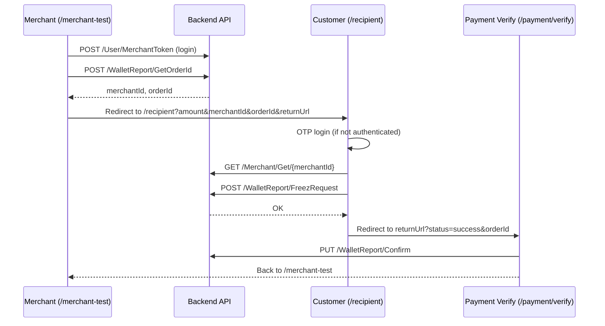

# Novalend V2 — Recipient Payment Gateway

**Status:** In progress (V2)  
**Last updated:** July 2026  
**Owner:** Frontend team  
**Entry point in routing:** `src/routes.jsx` (lines 16–17)

---

## Overview

These two routes implement the **merchant payment gateway flow** for Novalend V2:

| Route            | Component                       | Purpose                                                              |
| ---------------- | ------------------------------- | -------------------------------------------------------------------- |
| `/merchant-test` | `MerchantTest`                  | Internal/dev panel for merchants to log in and create payment orders |
| `/recipient`     | `Recipient` (`Rcipient` export) | Customer-facing payment page — login + confirm payment               |

Together they simulate the full lifecycle: **merchant creates order → customer pays → merchant verifies payment**.



---

## Route Registration

Defined in `src/routes.jsx`:

```jsx
{ path: "/recipient", component: <Rcipient /> },
{ path: "/merchant-test", component: <MerchantTest /> },
```

Both routes are **public** (no `PrivateRoute` wrapper). They are rendered by `App.jsx` via a simple `routes.map()` over the `routes` array.

> **Note:** The export name is `Rcipient` (typo) in `src/pages/index.jsx`, while the component file is `Recipient.jsx`. Consider renaming to `Recipient` in V2 cleanup.

---

## File Map

```
src/
├── routes.jsx                              # Route definitions
├── pages/
│   ├── recipient/
│   │   ├── Recipient.jsx                   # Customer payment page (orchestrator)
│   │   └── MerchantTest.jsx                # Merchant test panel
│   └── paymentVerify/
│       └── PaymentVerify.jsx               # Callback / confirm step
└── components/newui/recipient/
    ├── Login.jsx                           # Customer OTP login
    ├── AcceptPayment.jsx                   # Payment confirmation UI
    ├── MerchantLogin.jsx                   # Merchant username/password login
    └── MerchantCreateOrder.jsx             # Create order + generate payment link
```

---

## `/merchant-test` — Merchant Test Panel

**File:** `src/pages/recipient/MerchantTest.jsx`

### Flow

1. Check `localStorage.merchantToken`
2. If missing → show `MerchantLogin`
3. If present → show `MerchantCreateOrder`

### Merchant Login

**Component:** `src/components/newui/recipient/MerchantLogin.jsx`

| Field    | Maps to                |
| -------- | ---------------------- |
| Username | `formData.phoneNumber` |
| Password | `formData.password`    |

**API:** `POST /api/v1/User/MerchantToken`

```json
{
  "username": "...",
  "password": "...",
  "grant_type": "password"
}
```

On success, stores `merchantToken` in `localStorage`.

### Create Order

**Component:** `src/components/newui/recipient/MerchantCreateOrder.jsx`

**API:** `POST /api/v1/WalletReport/GetOrderId`

```json
{
  "nationalcode": "...",
  "amount": "...",
  "IsOnline": true
}
```

**Headers:** `Authorization: Bearer {merchantToken}`

On success, builds a payment link:

```
{origin}/recipient?amount={amount}&merchantId={id}&orderId={orderId}&description=خریدکالا&returnUrl={origin}/payment/verify
```

The merchant opens this link (or sends it to the customer) to start payment.

---

## `/recipient` — Customer Payment Page

**File:** `src/pages/recipient/Recipient.jsx`

### URL Query Parameters

| Param         | Required | Description                           |
| ------------- | -------- | ------------------------------------- |
| `amount`      | Yes      | Payment amount in Rials               |
| `merchantId`  | Yes      | Merchant identifier                   |
| `orderId`     | No       | Order reference from merchant         |
| `description` | No       | Payment description shown to customer |
| `returnUrl`   | No       | Redirect URL after success/timeout    |

**Example:**

```
/recipient?amount=5000000&merchantId=7d16dbd5-6f6e-485e-97e7-8ea926f8ebe5&orderId=1000178&description=خریدکالا&returnUrl=https://example.com/payment/verify
```

### Steps (state machine)

| Step      | Condition                   | Component       |
| --------- | --------------------------- | --------------- |
| `login`   | No `aToken` in localStorage | `Login`         |
| `payment` | User authenticated          | `AcceptPayment` |

> Wallet selection step exists in commented code but is **not active** in the current flow.

### Session Timer

- **Duration:** 5 minutes (300 seconds)
- **Warning:** Toast at 60 seconds remaining
- **Expiry:** Redirects to `returnUrl` or `/` after 3 seconds
- Timer UI is fixed top-right on the page

### Customer Login

**Component:** `src/components/newui/recipient/Login.jsx`

Two-step OTP flow:

1. **Phone + Captcha** → `POST /api/v1/Register/UserRegister`
2. **OTP verify** → `POST /api/v1/User/Token` then `POST /api/v1/User/Login`

Stores `aToken` in localStorage and loads user profile via `GET /api/v1/User/Get/{userId}`.

On success, calls `onLoginSuccess()` → moves to payment step (does **not** navigate away).

### Accept Payment

**Component:** `src/components/newui/recipient/AcceptPayment.jsx`

1. **Fetch merchant:** `GET api/v1/Merchant/Get/{merchantId}`
2. **Process payment:** `POST api/v1/WalletReport/FreezRequest`

```json
{
  "IsOnline": true,
  "orderId": "...",
  "freezAmount": 5000000
}
```

3. On `resultMessage === "OK"` → success screen, then redirect:

```
{returnUrl}?status=success&orderId={orderId}
```

---

## Related Route: `/payment/verify`

**File:** `src/pages/paymentVerify/PaymentVerify.jsx`

Used as the default `returnUrl` from merchant test flow. Confirms payment on the merchant side.

**API:** `PUT /api/v1/WalletReport/Confirm`

```json
{ "orderId": 12345 }
```

**Headers:** `Authorization: Bearer {merchantToken}`

Expects query params: `?status=success&orderId=...`

On completion, user can navigate back to `/merchant-test`.

---

## API Summary

| Endpoint                            | Method | Auth              | Used by             |
| ----------------------------------- | ------ | ----------------- | ------------------- |
| `/api/v1/User/MerchantToken`        | POST   | —                 | MerchantLogin       |
| `/api/v1/WalletReport/GetOrderId`   | POST   | merchantToken     | MerchantCreateOrder |
| `/api/v1/Captcha/GenerateCaptcha`   | GET    | —                 | Login               |
| `/api/v1/Register/UserRegister`     | POST   | Captcha headers   | Login               |
| `/api/v1/User/Token`                | POST   | —                 | Login               |
| `/api/v1/User/Login`                | POST   | aToken            | Login               |
| `/api/v1/User/Get/{userId}`         | GET    | aToken            | Login               |
| `/api/v1/Merchant/Get/{merchantId}` | GET    | —                 | AcceptPayment       |
| `/api/v1/WalletReport/FreezRequest` | POST   | — (axiosInstance) | AcceptPayment       |
| `/api/v1/WalletReport/Confirm`      | PUT    | merchantToken     | PaymentVerify       |

**Base URL:** `import.meta.env.VITE_BASE_API`

---

## Local Storage Keys

| Key             | Set by           | Used by                            |
| --------------- | ---------------- | ---------------------------------- |
| `merchantToken` | MerchantLogin    | MerchantCreateOrder, PaymentVerify |
| `aToken`        | Login (customer) | Recipient, AcceptPayment, Login    |
| `userInfo`      | Login (Redux)    | App auth state                     |

---

## V2 Work Items

Use this checklist when picking up tasks:

### High priority

- [ ] **Rename `Rcipient` → `Recipient`** in `pages/index.jsx` and `routes.jsx`
- [ ] **Wallet selection step** — commented code in `Recipient.jsx` and `AcceptPayment.jsx`; decide if V2 needs multi-wallet support
- [ ] **Error handling** — `MerchantCreateOrder` sets `userLogged(true)` even on failed login; fix auth guard logic
- [ ] **401 handling** — `MerchantCreateOrder` checks `err.status` but axios uses `err.response.status`
- [ ] **Consistent HTTP client** — mix of `axiosInstance` and raw `axios`; standardize on one

### UX / Product

- [ ] Replace hardcoded `description=خریدکالا` with merchant-provided description
- [ ] Make `returnUrl` configurable in merchant test form (field is commented out)
- [ ] Decide fate of `/merchant-test` in production (dev-only vs real merchant portal)
- [ ] RTL / mobile polish pass on recipient components
- [ ] Loading and empty states when `amount` or `merchantId` missing from URL

### Security

- [ ] Validate query params server-side; do not trust client-only checks
- [ ] Review whether `/recipient` should require signed URLs or tokens from merchant
- [ ] Ensure `returnUrl` is allowlisted to prevent open redirects

### Testing

Manual test path:

1. Go to `/merchant-test`
2. Log in with merchant credentials
3. Enter national code + amount → create order
4. Open generated `/recipient` link
5. Log in as customer (OTP)
6. Confirm payment
7. Verify redirect to `/payment/verify?status=success&orderId=...`
8. Confirm merchant sees success and can return to `/merchant-test`

---

## Environment

Requires `.env`:

```
VITE_BASE_API=https://your-api-base-url
```

---

## Questions for Team Discussion

1. Should `/merchant-test` remain in V2 production builds or move behind a feature flag?
2. Is wallet selection required for V2, or is single-wallet freeze sufficient?
3. What is the final merchant integration model — redirect link, iframe, or API-only?
4. Should customer login on `/recipient` be separate from main app login (`/login`)?

---

## Contact

For API contract changes, coordinate with the backend team on `WalletReport` and `Merchant` endpoints before changing frontend payloads.
